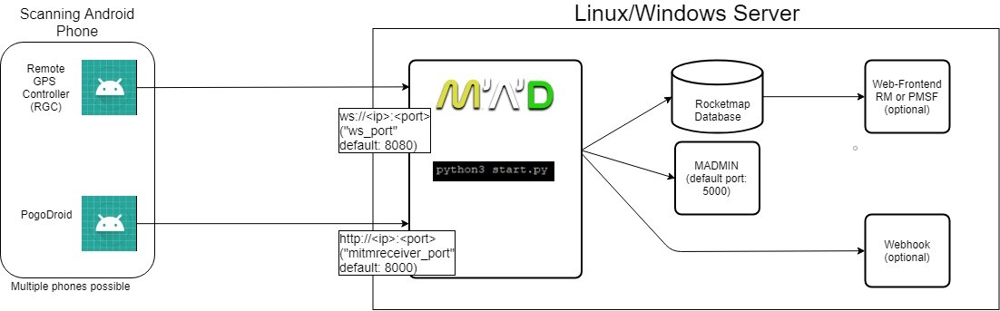

## How does it work?
MAD or Map-A-Droid is a system to collect data from the game. It uses real Android devices. MAD is able to scan for raids, quests, mon and their IVs.

### MAD
MAD is the software running on your server. Devices connect to it and will then be controlled by the server.

### Android devices
The device needs run the game, must be rooted, pass the [SafetyNet Check](https://koz.io/inside-safetynet/) and SELinux must be permissive or moderate. To root your device, use [Magisk](https://www.xda-developers.com/how-to-install-magisk/).

#### Remote GPS Controller (RGC)
RGC is an app developed by the MAD team to control the device in various ways. It handles the GPS spoofing, touch/text inputs, app starts/stops etc.

#### PogoDroid
This app injects into the running Pokémon GO process and relays the [Protos](https://github.com/Furtif/POGOProtos) sent to Pokémon GO to the MAD server. A valid token is required to use it, you can purchase it on [the MAD website](https://www.maddev.de/).

