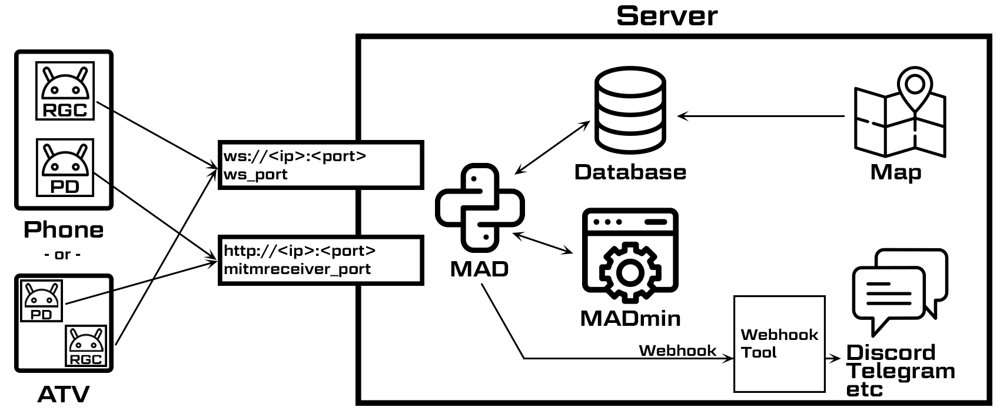

.. title:: MAD docs

=========================
Map'A'Droid Documentation
=========================

This is a collection of articles about setting up and running MAD.

What is this?
=============
Map-A-Droid (MAD) is a system to collect data from the game. It uses real Android devices. MAD is able to scan for raids, quests, mon and their IVs.

.. _sec_root_mad:

MAD
-------------------
MAD is the software running on your server. Devices connect to it and will then be controlled by the server.

Android devices
---------------
The device needs run the game, must be rooted, pass the `SafetyNet Check <https://koz.io/inside-safetynet>`_ and SELinux must be permissive or moderate. To root your device, use `Magisk <https://www.xda-developers.com/how-to-install-magisk>`_.

Remote GPS Controller (RGC)
^^^^^^^^^^^^^^^^^^^^^^^^^^^
RGC is an app developed by the MAD team to control the device in various ways. It handles the GPS spoofing, touch/text inputs, app starts/stops etc.

PogoDroid (PD)
^^^^^^^^^^^^^^
This app injects into the running game process and relays the data being sent to the game to the MAD server. A valid token is required to use it, you can purchase it on `the MAD website <https://www.maddev.eu>`_.

Contributing to this wiki
=========================

If you want to contribute to this wiki, create a pull request to the `GitHub repository <https://github.com/Map-A-Droid/MAD-docs>`_.

The files are either markdown (:code:`.md`) or reStructuredText (:code:`.rst`). Here is a `cheatsheet <http://thomas-cokelaer.info/tutorials/sphinx/rest_syntax.html>`_ for RST formatting, and one for `markdown <https://github.com/adam-p/markdown-here/wiki/Markdown-Cheatsheet>`_. If you created a new section, make sure to add it to the toctree below this section right here.

To preview your changes, make sure to install the requirements (:code:`pip install -r requirements.txt` and :code:`pip install sphinx-autobuild`), open a terminal and use ``make auto``. Those commands works on Windows and Linux. This will start a local webserver on port 8000 with live updates pages as you save them. 

.. toctree::
  :maxdepth: 2
  :hidden:

  installation/index
  device_setup/index
  madmin/index
  api/index
  extras/index
  faq