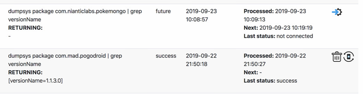
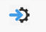
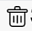
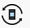
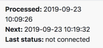

# Job Monitor

## Example Pic

## Icons

Automatic Job (cannot delete!)

Delete existing Job

Restart Job

## Job Status

- **Processed** == Last processing date / time of the job
- **Next** == Next date / time of the job
- **Last Status** == last job status

