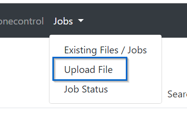

# MAD Job Processor


In the last MAD version a job processor was implemented. With this tool are you able to start manuall or automatic jobs for:

- Delivery new Software
- Start scripts on devices
- Get informations about the device

### Job Types
- manually Jobs - start with MADmin
- [automatically Jobs](/job/automatic_jobs)

### Job Monitor

see [Jobmonitor](/job/job_monitor)

### Discord Alert

see [Discord Alert](/job/discord_alert)

### MADmin Endpoint

see [MADmin_Endpoint](/job/MADmin_Endpoint)

-----------------------------------------------

## Add Software

### Path Settings

Use `upload_path` in config.ini to define the software folder for your MAD installation 
(Default: `upload` in MAD root folder)

### MADmin

Open MADmin -> Jobs -> Upload File



Select APK and Upload it.
(Only *.APK allowed at the moment)

### direct Upload

Upload APK directly in `upload_path` (config.ini)

## Add Job

 Create Folder `personal_commands` in MAD root. You could copy new jobs als `*.json` file in it.

MAD readout the new jobs with every restart.

### Example Jobs

```
{
    "Readout Pogo Version":
    [
        {
            "TYPE": "jobType.PASSTHROUGH",
            "SYNTAX": "dumpsys package com.nianticlabs.pokemongo | grep versionName"
            "FIELDNAME": "POGO_Version"
            "WAITTIME": 5
        }
    ]
}
```

This Job read the Version Number of Pogo.

### Field Description

- `Readout Pogo Version` == Name of Job
- `TYPE:` `jobType.PASSTHROUGH` == [Type of Job](/job/jobtypes)
- `SYNTAX:` `dumpsys package com.nianticlabs.pokemongo | grep versionName` == Shell Command
- `FIELDNAME:` `POGO_Version` == Fieldname for returning Value
- `WAITTIME:` `5` == Wait 5 minutes before start the job

You are able to start more then one command with one job --> [Nested Jobs](/job/nested_jobs)

 