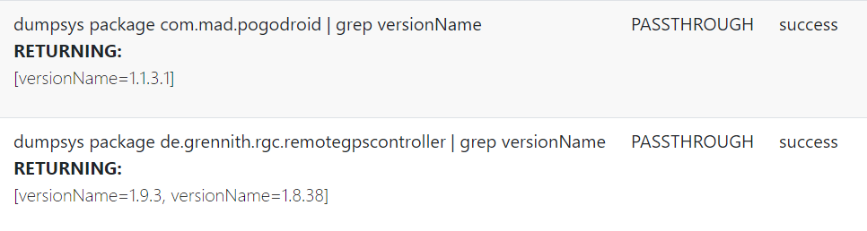

# Nested Jobs

You are able to combine more jobs to one nested job. Add them to one Job File.

##Example

```
{
    "Stop/Start Pogo and readout Memory Usage":
    [
        {
            "TYPE": "jobType.STOP",
            "SYNTAX": "STOP Pogo"
        },
        {
            "TYPE": "jobType.PASSTHROUGH",
            "SYNTAX": "dumpsys meminfo | egrep -w 'Total RAM|Free RAM|Used RAM'",
            "FIELDNAME": "MEMORY_USAGE",
            "WAITTIME": 3
        },
        {
            "TYPE": "jobType.START",
            "SYNTAX": "START Pogo"
        }
    ]
}
```

This nested Job runs like a waterfall - from top to bottom.

##Behavior after scheduling the job

MAD starts the first Job (STOP Pogo) and schedule the Memory Usage readout with a dealy of 3 minutes.
Finally pogo gets starts.

##Job processing

- If one of the jobs gets an error - all following jobs will be cancelled.
- All subjobs in a newsted job will be show as single job in job monitor.

